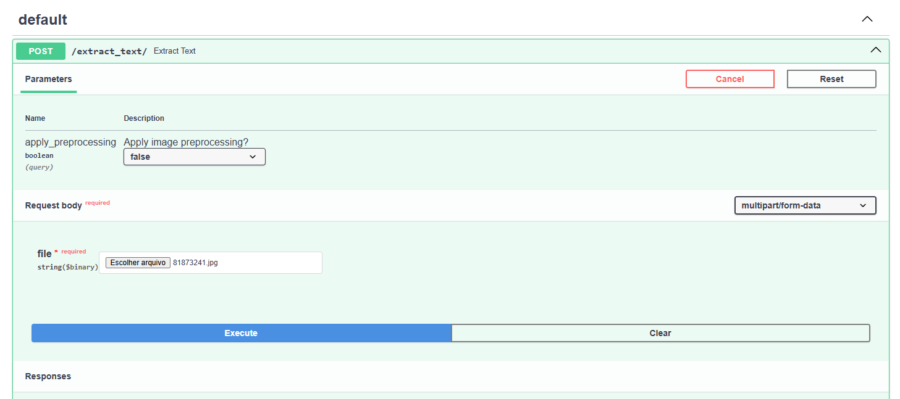
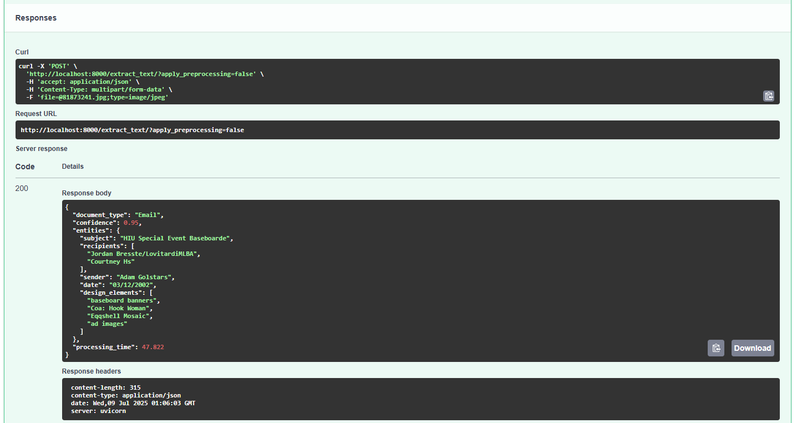
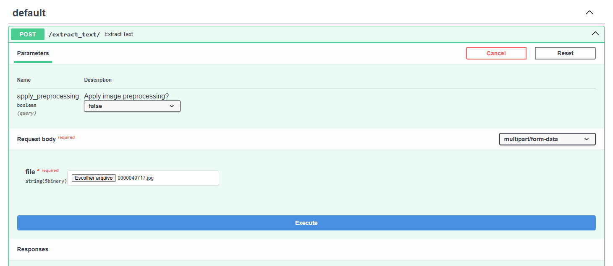
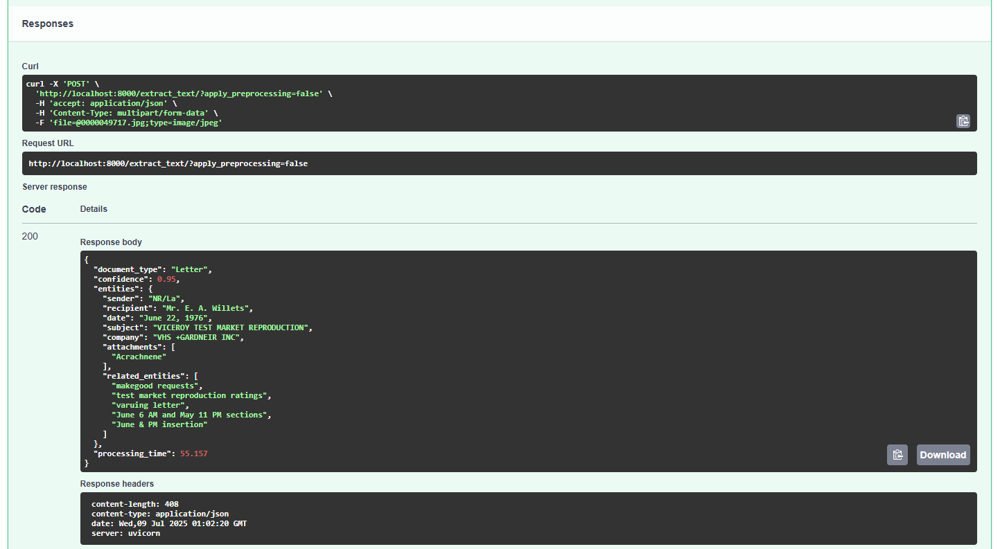

# Intelligent Document Understanding

This project is an Intelligent Document Understanding (IDU) system that uses Optical Character Recognition (OCR) to extract text from documents and a Large Language Model (LLM) to classify them.

## How it Works

The system is built as a FastAPI application and uses Docker for containerization. The pipeline is as follows:

1.  **File Upload**: The user uploads a document (image or PDF) to the `/extract_text/` endpoint.
2.  **OCR**: The system uses Tesseract OCR to extract the text from the uploaded document. It can also apply image preprocessing to improve the OCR results.
3.  **Text Classification**: The extracted text is then sent to a Large Language Model (Ollama) to be classified into a document type.
4.  **Response**: The classification result is returned to the user.

## Installation

To run this project, you need to have Docker and Docker Compose installed.

1.  **Clone the repository**:
    ```bash
    git clone https://github.com/ViniciusSimm/IntelligentDocumentUnderstanding.git
    cd IntelligentDocumentUnderstanding
    ```

2.  **Build and run the containers**:
    ```bash
    docker-compose up -d
    ```
    This command will build the Docker image for the FastAPI application, pull the Ollama image, and start both containers in detached mode.

    You may have to wait a few minutes while the model is being downloaded.
    For this project, the qwen3:4b model was used.

## How to Use

Once the containers are running, you can use the `/extract_text/` endpoint to classify your documents.

You can use `curl` to send a POST request to the endpoint with your document.

```bash
curl -X POST -F "file=@/path/to/your/document.png" "http://localhost:8000/extract_text/"
```

You can also use the `apply_preprocessing` query parameter to apply image preprocessing to your document.

```bash
curl -X POST -F "file=@/path/to/your/document.png" "http://localhost:8000/extract_text/?apply_preprocessing=true"
```

You can also access the API using a browser by accessing the following link and pressing the "Try it out" button: http://localhost:8000/docs

The response will be a JSON object with the classification of the document.

## Examples

### Email

**Input:**


**Output:**


### Letter

**Input:**


**Output:**


---
**Note on Data Source:** The dataset utilized for the generation of Retrieval-Augmented Generation (RAG) documentation was sourced from: [https://www.kaggle.com/datasets/shaz13/real-world-documents-collections](https://www.kaggle.com/datasets/shaz13/real-world-documents-collections)